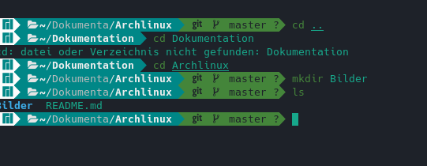

#Archlinux Installation

###Foto hinzufügen beispiel

###Tastatur Layout
>` loadkeys de-latin1 `

###Password for root user
>` passwd`

###IP von Archlinux anzeigen
`ip addr `

###Auf Manjaro ssh verbidung erstellen
`ssh root@ip_von_Archlinux`

#In zwischen setzen die Einstellungen für github um.
`Create repisotory on Github`

###Create project file on Local computer
`mkdir Projekt` 

### start git
`git init`
###Push your projekt in staging Area
`git add . '
###Commit your Changes
`git commit -m "message" `
###Proceedure for git
`git remote set-url add origin #yourProjektLink`
`git remote set-url origin #yourProjektLink`
`git push -u origin master`

#Weiter zum Installation von Archlinux 
