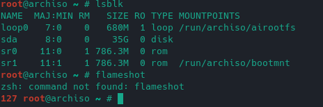
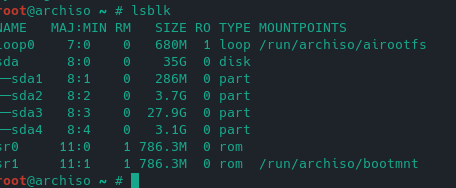
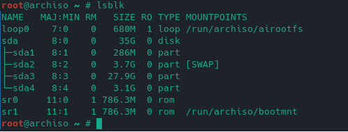

#Archlinux Installation

###Foto hinzufügen beispiel

###Tastatur Layout
	' loadkeys de-latin1 '

###Password for root user
>` passwd`

###IP von Archlinux anzeigen
>`ip addr `

###Auf Manjaro ssh verbidung erstellen
>`ssh root@ip_von_Archlinux`

#In zwischen setzen die Einstellungen für github um.
>`Create repisotory on Github`

###Create project file on Local computer
>`mkdir Projekt` 

###Start git
>`git init`

###Push your projekt in staging Area
>`git add . '

###Commit your Changes
>`git commit -m "message" `

###Proceedure for git
>`git remote set-url add origin #yourProjektLink`

>`git remote set-url origin #yourProjektLink`

>`git push -u origin master`

#Weiter zum Installation von Archlinux

###Lese festplatte 
>`lsblk`

 

### Update system Datenbank

	pacman -Syy
### Mirrors Aktualisieren

	reflector -c Germany -a 6 --sort rate --save /etc/pacman.d/mirrorlist
### Datenbank aktualisieren

	packman -Syy
### Partitionierungstools starten

	cfdisk /dev/sda
1. 300MB  >> EFI	 EFI System
2. 4GB    >> SWAP	SWAP	
3. 30 GB  >> /		LinuxFileSystem
4. Rest  >>  /home	LinuxFileSystem		
5. Write >>Quit

 

### Partitionsformat

###EFI FORMAT

	mkfs.fat  -F32 /dev/sda1

###SWAP Format

	mkswap /dev/sda2
###SWAP aktivierien

	swapon /dev/sda2
###Root Format

	mkfs.ext4 /dev/sda3
###Home Format

	mkfs.ext4 /dev/sda4

 
